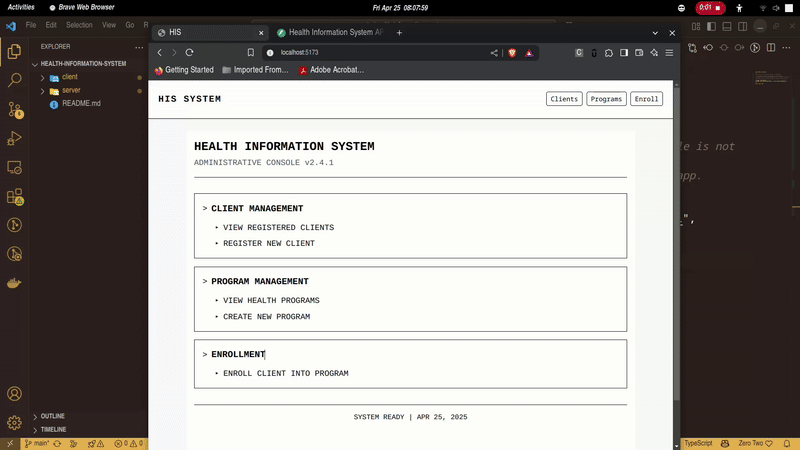

# 🏥 Health Information System API

A simple, modular full-stack application that simulates a basic health information system. Built with **FastAPI** (backend) and **React** (frontend).

---
## 🎬 Demo

## 📌 Features

- ✅ Register new clients (patients)
- ✅ Create and manage health programs (HIV, TB, etc.)
- ✅ Enroll clients in one or more programs
- ✅ View client profiles and enrolled programs
- ✅ REST API with Swagger docs
- ✅ Modular folder structure and clean code

---

## 🏗️ Tech Stack

- **Backend:** FastAPI, SQLAlchemy, Pydantic
- **Frontend:** React + TypeScript 
- **Database:** SQLite (for demo) or PostgreSQL
- **Dev Tools:** Uvicorn, dotenv

## 📚 Documentation

- [Server (FastAPI) README](./server/README.md)
- [Client (React) README](./client/README.md)

## 🌐 Live Links

> **Note:** Please access the backend API link **first** to complete a security check. Since the backend does not use SSL, it is protected by a firewall that requires initial access. After passing the security check, you can proceed to use the frontend and API documentation links as usual.

- **Backend API Docs:** [18.206.57.6/docs](https://18.206.57.6/docs)

- **Frontend App:** [health-information-system-six.vercel.app](https://health-information-system-six.vercel.app/)

Explore the live demo using the links above. The frontend provides a user-friendly (OLD SCHOOL) interface, while the backend Swagger docs allow you to interact with the API endpoints directly.